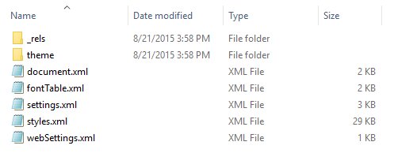
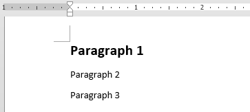
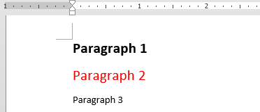
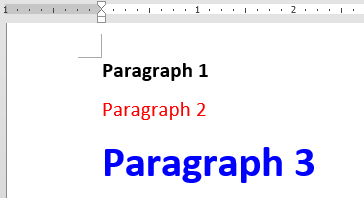

# OpenXML Styles 101 - Creating Custom Styles and Understanding Style Inheritance

[JCurry](https://social.msdn.microsoft.com/profile/JCurry) 9/16/2015
12:00:00 PM

-----

Introduction  
This will be the first in a series of articles on various OpenXML
topics. This article provides an expanded description of how Style
Inheritance works. We will be using an example created in Microsoft Word
2016 and then manually modifying the package contents.  
  
By simply reading through this blog you should be able to grasp how to
manually create your own custom styles and how to build more complex
styles using Style Inheritance. However, nothing beats getting some
actual hands-on experience. I highly encourage you to perform the steps
as they are presented here and experiment on your own.  
  
  
Resources  
This article will refer exclusively to information contained in [ISO/IEC
29500-1](http://blogs.msdn.com/controlpanel/blogs/posteditor.aspx/ISO/IEC%2029500-1 "https://aka.ms/sl6tli").
The latest version, as of this article's release date, was published in
September of 2012 and can be downloaded from the following
location.  
  
[http://standards.iso.org/ittf/PubliclyAvailableStandards/index.html](http://standards.iso.org/ittf/PubliclyAvailableStandards/index.html "https://aka.ms/em8mad")  
  
  
Getting Started  
We will start by creating a very simple document that contains three
paragraphs. The actual contents of the paragraphs isn't very important,
but it makes it easier to identify each one in the XML if they are
numbered on some
way.  
  
[  
*Figure 1: Three paragraphs in the
default style.*  
  
Save the document and then rename the file with a .zip extension.  
  
**Note:** It is assumed
that you already understand that the .DOCX, .XLSX, and .PPTX file
formats are actually special .ZIP packages that contain all of the XML
files used to construct the document. [ISO/IEC
29500-1](http://blogs.msdn.com/controlpanel/blogs/posteditor.aspx/ISO/IEC%2029500-1 "https://aka.ms/sl6tli")
section 9 contains a summary of the package format. [ISO/IEC
29500-2](http://blogs.msdn.com/controlpanel/blogs/posteditor.aspx/ISO/IEC%2029500-2 "https://aka.ms/bgdzkr")
deals exclusively with the Open Packaging Conventions (OPC) format.  
  
  
Examining the Package Contents  
Once you have renamed the file to have a .zip extension, go ahead and
extract the contents. Open the folder and then examine the contents of
the "word" folder. The contents should look similar to
this.  
  
[  
*Figure 2: The contents of the "word"
folder.*  
  
The two files that we will be working with are document.xml and
styles.xml. Go ahead and open the document.xml and styles.xml files in a
basic text editor. The first thing you will notice is that the contents
are one big blob of text without any kind of formatting unless you are
using an application that was designed specifically for editing XML
files. There are a few different ways to fix this, but if you are a
Visual Studio user you can use the Edit -\> Advanced -\> Format Document
command.  
  
The section of the document.xml file that we will be working with is in
the middle that has our three paragraphs.  
  
*document.xml*  
\<w:p
w:rsidR="00BA6E33" w:rsidRDefault="009A7F68"\>  
 
 \<w:r\>  
     
\<w:t\>Paragraph 1\</w:t\>  
 
 \</w:r\>  
\</w:p\>  
\<w:p
w:rsidR="009A7F68" w:rsidRDefault="009A7F68"\>  
 
 \<w:r\>  
     
\<w:t\>Paragraph 2\</w:t\>  
 
 \</w:r\>  
\</w:p\>  
\<w:p
w:rsidR="009A7F68" w:rsidRDefault="009A7F68"\>  
 
 \<w:r\>  
     
\<w:t\>Paragraph 3\</w:t\>  
 
 \</w:r\>  
 
 \<w:bookmarkStart w:id="0" w:name="\_GoBack"/\>  
 
 \<w:bookmarkEnd
w:id="0"/\>  
\</w:p\>  
  
There isn't anything in the styles.xml file that we really care about
right now. The only thing worth taking note of is the "Normal" style
near the bottom of the file.  
  
*styles.xml*  
\<w:style
w:type="paragraph" w:default="1" w:styleId="Normal"\>  
   \<w:name
w:val="Normal"/\>  
 
 \<w:qFormat/\>  
\</w:style\>  
  
  
Creating a New Style  
Additional details on the style element can be found in [ISO/IEC
29500-1](http://blogs.msdn.com/controlpanel/blogs/posteditor.aspx/ISO/IEC%2029500-1 "https://aka.ms/sl6tli")
section 17.7.4.17. For now, we will create a very simple style that is
based on the Normal style, sets it to be Bold, and increases the font
size.  
  
*styles.xml*  
\<w:style
w:type="paragraph" w:styleId="MyCustomStyle1"\>  
   \<w:name
w:val="My Custom Style 1"/\>  
 
 \<w:basedOn w:val="Normal"/\>  
 
 \<w:rPr\>  
      \<w:sz
w:val="32"/\>  
      \<w:b
w:val="true"/\>0  
 
 \</w:rPr\>  
\</w:style\>  
  
Next, we will assign this style to the first paragraph of our
document.  
  
*document.xml*  
\<w:p
w:rsidR="00BA6E33" w:rsidRDefault="009A7F68"\>  
 
 \<w:pPr\>  
     
\<w:pStyle w:val="MyCustomStyle1"/\>  
 
 \</w:pPr\>  
 
 \<w:r\>  
     
\<w:t\>Paragraph 1\</w:t\>  
 
 \</w:r\>  
\</w:p\>  
  
After you make those changes and save the files you will need to update
the package contents. It's important to understand that you can't just
re-zip the main folder and put a .docx extension on it. It will be
missing all of the metadata. The best way to update the package contents
is to overwrite the existing files in the original .zip package with the
updated ones and then rename back to the .docx extension. After you do
that and open the file it Word it should look like
this.  
  
[  
*Figure 3: MyCustomStyle1 applied to
the first paragraph.*  
  
  
Inheriting From a Custom Style  
For the second paragraph lets create a new style that inherits from the
one used in the first paragraph. We will add a new element and change an
existing one to demonstrate how the style at the leaf level overrides
the style(s) further up the inheritance tree.  
  
*styles.xml*  
\<w:style
w:type="paragraph" w:styleId="MyCustomStyle2"\>  
   \<w:name
w:val="My Custom Style 2"/\>  
 
 \<w:basedOn w:val="MyCustomStyle1"/\>  
 
 \<w:rPr\>  
      \<w:b
w:val="false"/\>  
     
\<w:color w:val="FF0000"/\>  
 
 \</w:rPr\>  
\</w:style\>  
  
And assign the new style to the second paragraph…  
  
*document.xml*  
\<w:p
w:rsidR="009A7F68" w:rsidRDefault="009A7F68"\>  
 
 \<w:pPr\>  
     
\<w:pStyle w:val="MyCustomStyle2"/\>  
 
 \</w:pPr\>  
 
 \<w:r\>  
     
\<w:t\>Paragraph 2\</w:t\>  
 
 \</w:r\>  
\</w:p\>  
  
Update the package contents again and let's take a look at the
result.  
  
[  
  
*Figure 4: MyCustomStyle2 applied to
the second paragraph*  
  
As you can see the text in the second paragraph is still 16pt in size
which was inherited from MyCustomStyle1, is no longer bold, and is now
red.  
  
  
Overwriting Everything  
Regardless of what is inherited from previous styles in the tree, it is
possible to simply overwrite everything. There is no real practical use
for this. Creating a new style that doesn't inherit from another style
is probably a better choice and will give the same results, but we are
doing this for demonstration purposes. Here is a third style that
inherits from the second style that overwrites each property set
previously.  
  
*styles.xml*  
\<w:style
w:type="paragraph" w:styleId="MyCustomStyle3"\>  
   \<w:name
w:val="My Custom Style 3"/\>  
 
 \<w:basedOn w:val="MyCustomStyle2"/\>  
 
 \<w:rPr\>  
      \<w:sz
w:val="64"/\>  
      \<w:b
w:val="true"/\>  
     
\<w:color w:val="0000FF"/\>  
 
 \</w:rPr\>  
\</w:style\>  
  
And apply it to the third paragraph…  
  
*document.xml*  
\<w:p
w:rsidR="009A7F68" w:rsidRDefault="009A7F68"\>  
 
 \<w:pPr\>  
     
\<w:pStyle w:val="MyCustomStyle3"/\>  
 
 \</w:pPr\>  
 
 \<w:r\>  
     
\<w:t\>Paragraph 3\</w:t\>  
 
 \</w:r\>  
 
 \<w:bookmarkStart w:id="0" w:name="\_GoBack"/\>  
 
 \<w:bookmarkEnd
w:id="0"/\>  
\</w:p\>  
  
And take a look at the
result.  
  
[  
*Figure 5: MyCustomStyle3 applied to
the third paragraph.*  
  
As you can see the font size is now set to 32pt, bold has been turned on
again, and the text is blue.  
  
  
Summary  
Thank you for taking the time to read through this article. This was a
simple introduction to how Style Inheritance works in Open XML. I hope
that this was useful for you and answered any questions that you may
have had on the subject. In future articles we will dig deeper into
styles and explore other topics such as the Style Hierarchy, Linked
Styles, and more.  
  
I encourage you to send you feedback or questions regarding this
article, or any other Open XML related topics to Microsoft
Interoperability Support at
[dochelp@microsoft.com](mailto:dochelp@microsoft.com "mailto:dochelp@microsoft.com")
or posted on the Office XML, ODF, and Binary File Formats forum on MSDN.

